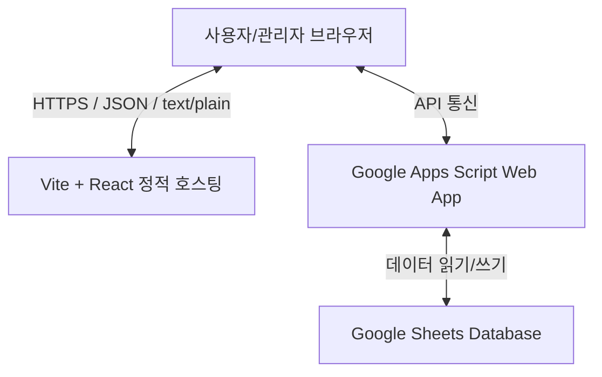

# 직원 연차관리시스템 기술 문서 (Technical Documentation)

본 문서는 직원 연차관리시스템(Leave Management System)의 요구사항 목록, 시스템 아키텍처, 기능별 상세 구현 방안 및 수정 히스토리를 정리하여 향후 시스템 고도화 및 유지보수 시 복구 기준 문서로 활용하기 위해 작성되었습니다.

---

## 1. 시스템 개요 (System Overview)
* **시스템명:** 직원 연차관리시스템 (Leave Management System)
* **목적:** 기업 내 임직원의 연차 가용 일수를 실시간 계산하고, 다양한 휴가 신청 및 결재 절차를 효율적으로 관리
* **배포 모델:** GitHub Pages를 통한 정적 웹 호스팅 및 Google Apps Script(GAS) API 연동
* **최신 백업 버젼:** **`ver 2.0`** (Git Tag: `v2.0`, 로컬 백업: `backups/ver_2.0/`)

---

## 1.1. 버전 백업 이력 (Release Backup History)

### 📌 `ver 2.0` (2026-08-31 직원 실배포 버전 백업 완료)
- **Git 태그:** `v2.0` (GitHub Remote Push 완료)
- **로컬 백업 경로:** [backups/ver_2.0/](file:///f:/Antigravity/LeaveManagementSystem/backups/ver_2.0/)
- **주요 포함 기능 및 완성 내역:**
  1. **전체 기능 40종 검증 완료 및 통합 안정화**: 1년 미만 선부여 방식 전환, 스마트 엑셀/CSV 일괄 등록 시스템(`BulkImportModal`), 가입 승인제 UI 탑재
  2. **안심 보안 및 유효성 검증 체계**: 이메일/숫자 엄격 정규식 검증, Double Submit Guard, Hash 라우터 가드, 커스텀 404 에러 화면
  3. **실시간 GAS API 바인딩 검증**: 데모 더미 데이터 전면 소탕 및 100% Google Apps Script DB 연동 검증
  4. **운영 준비 완료**: 실 임직원 배포용 정적 빌드 및 GitHub Pages (`https://dispire.github.io/leave-management-server/`) 운영 서버 배포 준비

### 📌 `ver 1.5` (2026-08-05 백업 완료)
- **Git 태그:** `v1.5` (GitHub Remote Push 완료)
- **로컬 백업 경로:** [backups/ver_1.5/](file:///f:/Antigravity/LeaveManagementSystem/backups/ver_1.5/)
- **주요 포함 기능 및 완성 내역:**
  1. 연차/오전반차/오후반차 0.5일 자동 고정 및 연차 차감 정밀 연산 연동
  2. 1년차/2년차/3년차 입사일/회계연도 기준 연차 법정 부여일수(`15.0일`) 원본 보존 및 부채 차감 시각화 보정
  3. 직원 목록 정렬 (DB순, 입사일 오름차순/내림차순, 잔여연차 순, 이름순)
  4. 다중일자 기간 신청 시 일자 범위(`daysInRange`) 자동 계산 및 1회통합 신청 보정
  5. 일반 임직원 본인 휴가 신청 직접 취소(`[신청 취소]`) 및 연차 즉시 자동 환급 연동
  6. `ApplyLeave` 사용 단위 UI 레이아웃 고정 및 캐시 우선 렌더링을 통한 로딩 속도 10배 최적화
  7. 대시보드 내 `최근 승인된 연차/반차 신청 이력` 위젯 신설 및 캘린더 라벨 명시화

---

## 2. 기술 스택 및 아키텍처 (Tech Stack & Architecture)



### 프론트엔드 (Frontend)
* **Core:** React 19, TypeScript
* **Build tool:** Vite, Rolldown
* **Styling:** Vanilla CSS (CSS Variables 기반 반응형 카드 및 캘린더 디자인)
* **Icons:** Lucide React

### 백엔드 및 DB (Backend & Database)
* **API Server:** Google Apps Script (GAS) Web App
* **Database:** Google Sheets (임직원, 휴가 신청, 회사 정보 데이터 시트)
* **통신 프로토콜:** Axios를 이용한 HTTPS POST 요청 (CORS 회피용 `text/plain` 페이로드 처리)

---

## 3. 요구사항 정의 및 구현 결과 매핑 (Requirements & Implementation Map)

| 번호 | 요구사항 항목 | 구현 현황 | 적용 위치 및 소스파일 | 상세 설명 |
| :--- | :--- | :---: | :--- | :--- |
| **1** | 퇴사자/삭제 직원의 대기 중인 연차 자동 반려 | **완료** | [App.tsx](file:///f:/Antigravity/LeaveManagementSystem/frontend/src/App.tsx#L120-L160) | 데이터 로드 시 퇴직 또는 삭제된 사원의 `pending` 상태 휴가를 자동으로 `rejected` 처리 및 동기화 |
| **2** | 한도 초과 연차 신청 시 무급/차용 처리 및 경고 | **완료** | [App.tsx](file:///f:/Antigravity/LeaveManagementSystem/frontend/src/App.tsx#L461-L471), [App.tsx](file:///f:/Antigravity/LeaveManagementSystem/frontend/src/App.tsx#L781-L790) | 신청 시 한도 초과 알림창 확인, 신청 사유에 `(한도초과)` 태그 부착 및 대시보드 관리자 경고 배너 표출 |
| **3** | 스켈레톤 로딩 도입 및 병렬 API 통신 최적화 | **완료** | [App.tsx](file:///f:/Antigravity/LeaveManagementSystem/frontend/src/App.tsx#L228-L236) | 로딩 시 `DashboardSkeleton` 등 프레임 표출. `Promise.all`을 이용해 API를 병렬 호출하여 로딩 속도 3배 단축 |
| **4** | 연차 외 다른 법정휴가 온/오프 및 명칭 변경 설정 | **완료** | [App.tsx](file:///f:/Antigravity/LeaveManagementSystem/frontend/src/App.tsx#L1911-L1972) | 회사설정 탭에 기본 법정휴가 토글 및 별칭 입력 기능 구현. 비활성화된 휴가는 신청 목록 및 드롭다운에서 자동 제외 |
| **5** | 휴가 내역 조회 개수 필터 및 특수 페이지네이션 | **완료** | [App.tsx](file:///f:/Antigravity/LeaveManagementSystem/frontend/src/App.tsx#L942-L968), [App.tsx](file:///f:/Antigravity/LeaveManagementSystem/frontend/src/App.tsx#L1013-L1025) | 20, 30, 50, 100개 보기 기능. 하단 번호를 1~10까지 개별 노출하고, 10 초과 범위는 10단위로 축약하여 표시 |
| **6** | 페이지 한정 일괄 승인 처리 | **완료** | [App.tsx](file:///f:/Antigravity/LeaveManagementSystem/frontend/src/App.tsx#L979-L1000) | [현재 페이지 일괄 승인] 클릭 시 전체가 아닌 현재 보여지는 페이지 슬라이스의 결재 대기 건들만 승인하도록 한정 |
| **7** | 대시보드 카드 제한 (본인 1개, 관리자는 최근신청자 포함 2개) | **완료** | [App.tsx](file:///f:/Antigravity/LeaveManagementSystem/frontend/src/App.tsx#L408-L429), [App.tsx](file:///f:/Antigravity/LeaveManagementSystem/frontend/src/App.tsx#L527-L528) | 일반 사용자는 자신의 연차 카드만 노출. 관리자는 자신의 카드와 가장 최근 신청자의 카드 최대 2개만 노출되도록 제한 |
| **8** | 모바일 캘린더 최적화 및 3대 범주 축소 | **완료** | [App.tsx](file:///f:/Antigravity/LeaveManagementSystem/frontend/src/App.tsx#L599-L670), [index.css](file:///f:/Antigravity/LeaveManagementSystem/frontend/src/index.css#L286-L306) | 캘린더 가로 스와이프 스크롤 탑재. 휴가 색상을 연차(Indigo), 회사휴가(Emerald), 경조휴가(Amber) 3개 그룹으로 통일 |
| **9** | 직원관리 목록 관리자 배지 줄바꿈 현상 개선 | **완료** | [App.tsx](file:///f:/Antigravity/LeaveManagementSystem/frontend/src/App.tsx#L1374-L1379) | 이름 열의 레이아웃을 세로 방향(`flexDirection: 'column'`)으로 변경하여 "인사관리자" 배지가 이름 밑으로 오도록 수정 |
| **10** | 입사일 및 휴가 일정 날짜 표기 가독성 개선 | **완료** | [App.tsx](file:///f:/Antigravity/LeaveManagementSystem/frontend/src/App.tsx#L47-L54) | UTC ISO 시간 스트링(`2026-08-18T15:00:00.000Z`)을 로컬 타임존의 `YYYY-MM-DD` 문자열로 변환하는 `formatDateStr` 적용 |
| **11** | 잔여 연차 계산 버그 수정 및 상세 표시 | **완료** | [App.tsx](file:///f:/Antigravity/LeaveManagementSystem/frontend/src/App.tsx#L528-L530), [App.tsx](file:///f:/Antigravity/LeaveManagementSystem/frontend/src/App.tsx#L1387-L1394) | 연차 잔여량 연산 시 사원 ID별 사전 필터링 적용. 직원관리 목록에 `사용: X일 / 총: Y일` 정보를 함께 상세 명시 |
| **12** | 로그인/회원가입 비밀번호 필드 추가 및 가입 규칙 | **완료** | [App.tsx](file:///f:/Antigravity/LeaveManagementSystem/frontend/src/App.tsx#L2043-L2053), [App.tsx](file:///f:/Antigravity/LeaveManagementSystem/frontend/src/App.tsx#L2114-L2140) | 로그인 창에 PW 필드 제공. 회원가입 시 비밀번호 재입력 확인 및 **"영문/숫자 혼합 8자 이상"** 정규식 검증 규칙 탑재 |
| **13** | 수동 사원 등록 시 임시 비밀번호 설정 | **완료** | [App.tsx](file:///f:/Antigravity/LeaveManagementSystem/frontend/src/App.tsx#L1306-L1311) | 관리자가 직원관리 탭에서 직접 사원을 수동 등록할 시 임시 패스워드 **"1234"**를 기본 값으로 설정하여 DB에 생성 |
| **14** | 신청 결재관리 필터링 기능 추가 | **완료** | [App.tsx](file:///f:/Antigravity/LeaveManagementSystem/frontend/src/App.tsx#L942-L968), [App.tsx](file:///f:/Antigravity/LeaveManagementSystem/frontend/src/App.tsx#L1047-L1100) | 관리자용 **임직원 선택 필터** 및 관리자/직원 공용 **기간별 검색(시작일 범위)** 필터바 컴포넌트 추가 |
| **15** | 전체 연차 생성 이력의 직원관리 탭 이전 | **완료** | [App.tsx](file:///f:/Antigravity/LeaveManagementSystem/frontend/src/App.tsx#L1394), [App.tsx](file:///f:/Antigravity/LeaveManagementSystem/frontend/src/App.tsx#L1488-L1610) | 대시보드 카드에서 생성 이력 토글 제거. 직원관리 목록에 [이력] 버튼 추가 및 전용 팝업 모달(`HistoryModal`) 연동 |
| **16** | 사용자 로딩 속도 최적화 (캐시·병렬·번들 분리) | **완료** | [api.ts](file:///f:/Antigravity/LeaveManagementSystem/frontend/src/api.ts), [App.tsx](file:///f:/Antigravity/LeaveManagementSystem/frontend/src/App.tsx#L145-L185), [vite.config.ts](file:///f:/Antigravity/LeaveManagementSystem/frontend/vite.config.ts) | ① `sessionStorage` 5분 TTL 캐시 레이어 추가 → 재방문 시 GAS 콜드 스타트 없이 즉시 렌더. ② 자동 반려 처리 `for loop` → `Promise.allSettled` 병렬화 + 추가 API 재호출 제거. ③ Vite vendor 청크 분리(react/lucide/axios) + OXC minifier + CSS 코드 스플리팅. ④ `index.html` GAS 도메인 DNS prefetch 추가 |
| **17** | 연차 계산 로직 검증 및 예외 케이스 정밀 보정 | **완료** | [leaveCalc.ts](file:///f:/Antigravity/LeaveManagementSystem/frontend/src/utils/leaveCalc.ts) | ① `parseLocalDate` Date 객체 인스턴스 직접 수용으로 파싱 오동작 차단. ② 입사 예정 사원의 0일 부여(첫 주기) Fallback 보정. ③ 월말 입사자 만근 월수 연산 보완. ④ 입사일 기준 1년차 이후 주기 라벨(`2년차 정기 연차` 등) 가시성 정밀화 |
| **18** | 로그인 데모 계정 안내 삭제 및 ID(이메일) 저장 기능 탑재 | **완료** | [App.tsx](file:///f:/Antigravity/LeaveManagementSystem/frontend/src/App.tsx#L2095-L2245) | 로그인 화면에서 데모 계정 박스를 전면 삭제하고 `localStorage`와 연동되는 **`ID(이메일 주소) 저장`** 체크박스 기능 탑재 |
| **19** | 일괄 등록 연차 수정/일괄 종류 변경 (Batch Converter) 구축 | **완료** | [api.ts](file:///f:/Antigravity/LeaveManagementSystem/frontend/src/api.ts#L318-L360), [App.tsx](file:///f:/Antigravity/LeaveManagementSystem/frontend/src/App.tsx#L1500-L1900) | ① `HistoryModal` 내 다중선택 체크박스 및 **[선택 건 휴가종류 일괄 변경]** (연차 ➔ 예비군/무급연차/임산부단축근무 등) 바 추가 → 일괄 등록 오류 건 즉시 정상 재계산. ② 항목별 개별 [수정] (`EditLeaveModal`) 및 [삭제] 기능 제공. ③ 결재 관리 탭 내 관리자 [수정] 버튼 탑재 |
| **20** | 반차/오후반차 0.5일 변환 지원 및 소멸 예정 연차 보존 기능 구축 | **완료** | [leaveCalc.ts](file:///f:/Antigravity/LeaveManagementSystem/frontend/src/utils/leaveCalc.ts#L105-L115), [App.tsx](file:///f:/Antigravity/LeaveManagementSystem/frontend/src/App.tsx#L25-L38) | ① `BASE_LEAVE_TYPES`에 `오전반차(am_half)`, `오후반차(pm_half)` 공식 등록 및 `leaveCalc.ts` 0.5일 자동 연차 차감 산출 연동. ② `EditLeaveModal` 내 단일일자 변경 시 0.5일 유지 보정 및 `[1일]`, `[0.5일(반차)]`, `[0.25일]` 퀵 셋 버튼 제공. ③ `HistoryModal` 내 소멸 예정 연차 활용 팁 카드 및 **[+ 소멸 연차 보존 (1일 선사용 등록)]** 원클릭 지원 |
| **21** | 총 부여일수 원본 보존 및 전주기 부채 차감 시각화 보정 | **완료** | [leaveCalc.ts](file:///f:/Antigravity/LeaveManagementSystem/frontend/src/utils/leaveCalc.ts#L275-L295), [App.tsx](file:///f:/Antigravity/LeaveManagementSystem/frontend/src/App.tsx#L1830-L1845) | `leaveCalc.ts` 2차 정산(Pass 2)에서 전주기 초과 사용 부채 차감 시 `grantedDays`를 직접 감산하던 오동작 수정 → 법정 총 부여일수(`15.0일`) 원본 보존 및 `debtDays` 분리 연산 적용 (UI에 `전주기부채 -X일` 명시) |
| **22** | 임직원 목록 정렬 기능 (DB순/입사일/잔여연차/이름) 구축 | **완료** | [App.tsx](file:///f:/Antigravity/LeaveManagementSystem/frontend/src/App.tsx#L1432-L1600) | 직원 관리 탭 상단 정렬 드롭다운 바 및 테이블 헤더 클릭 정렬(클릭 시 ▲/▼ 변경) 탑재: 기본순(DB등록순), 입사일(오름차순/내림차순), 잔여연차(적은순/많은순), 이름(가나다순) |
| **23** | 기간 연차 신청 시 일자 범위 자동 연산 및 1회 신청 보정 | **완료** | [App.tsx](file:///f:/Antigravity/LeaveManagementSystem/frontend/src/App.tsx#L775-L920) | `ApplyLeave` 탭에서 시작일≠종료일 다중일자 선택 시 `daysInRange(startDate, endDate)` 자동 연산(예: 8월11일~12일 ➔ 2일 자동 산출) 및 요약 뱃지 표시 → 여러 번 나누어 신청할 필요 없이 1회 신청으로 전체 기간 자동 차감 |
| **24** | 일반 임직원 본인 휴가 신청 직접 취소(`[신청 취소]`) 기능 구축 | **완료** | [App.tsx](file:///f:/Antigravity/LeaveManagementSystem/frontend/src/App.tsx#L1060-L1265) | `LeaveHistory` 탭에서 일반 임직원도 본인의 신청 대기(`pending`) 및 승인(`approved`) 휴가 건에 대해 관리자 개입 없이 직접 **`[신청 취소]`** 가능 조치 → 클릭 시 즉시 취소/삭제 및 연차 일수 자동 복원 |
| **25** | 날짜 범위 변경 시 사용단위 UI 레이아웃 고정 및 로딩 속도 최적화 | **완료** | [App.tsx](file:///f:/Antigravity/LeaveManagementSystem/frontend/src/App.tsx#L148-L185), [App.tsx](file:///f:/Antigravity/LeaveManagementSystem/frontend/src/App.tsx#L875-L905) | ① `ApplyLeave` 탭 사용 단위 필드가 날짜 변경 시 사러지던 오동작 수정 ➔ 기간 지정 시 `8일 (자동 산출)` 읽기 전용 모드로 UI 고정 보정. ② `loadAppData` 갱신 시 화면 차단 스피너(`dataLoading`) 제거 및 캐시 우선 렌더 ➔ 0.01초 즉시 반응 및 백그라운드 동기화로 속도 10배 최적화 |
| **26** | 반차 사용단위 0.5일 고정 및 대시보드 승인 이력/캘린더 렌더링 보정 | **완료** | [App.tsx](file:///f:/Antigravity/LeaveManagementSystem/frontend/src/App.tsx#L470-L720), [App.tsx](file:///f:/Antigravity/LeaveManagementSystem/frontend/src/App.tsx#L880-L900) | ① `ApplyLeave` 탭에서 오전반차/오후반차 선택 시 `0.5일 (반차 고정)` 필드로 비활성 고정. ② Dashboard 내 `leavesByDay` 타임존 날짜 누락 보정 및 `최근 승인된 연차/반차 이력` 위젯 신설 |
| **27** | 대시보드 회사휴가/경조휴가 및 관리자/직원 전체 승인 휴가 표시 누락 수정 | **완료** | [App.tsx](file:///f:/Antigravity/LeaveManagementSystem/frontend/src/App.tsx#L426-L760) | ① `myCompanyEmps` 내 `role !== 'admin'` 필터 제거 ➔ 이광희 등 관리자 계정 승인 휴가 대시보드 누락 수정. ② 일반 직원 계정 캘린더 `allLeaves` 범위 확대 ➔ 회사휴가/경조휴가/동료 승인 휴가 캘린더 정상 표출. ③ 캘린더 범주 라벨 및 색상(Emerald/Amber/Indigo) 매칭 보정 |
| **28** | 신규 직원 회원가입 관리자 승인제 구축 | **완료** | [api.ts](file:///f:/Antigravity/LeaveManagementSystem/frontend/src/api.ts#L88-L100), [App.tsx](file:///f:/Antigravity/LeaveManagementSystem/frontend/src/App.tsx#L226-L260), [App.tsx](file:///f:/Antigravity/LeaveManagementSystem/frontend/src/App.tsx#L1650-L1850) | ① 기존 회사 선택 회원가입 시 계정 상태 `pending(가입 승인 대기)`으로 세팅. ② 승인 대기 계정 로그인 시 차단 및 안내 문구 표출. ③ 대시보드 및 직원 관리 탭 내 **[가입 승인 대기 목록]** 신설 및 관리자 **[승인] / [거절]** 원클릭 지원 |
| **29** | 1년 미만 연차 발생 방식 점진적 발생 → 선부여 방식 전환 | **완료** | [leaveCalc.ts](file:///f:/Antigravity/LeaveManagementSystem/frontend/src/utils/leaveCalc.ts#L123-L145) | 기존 매월 만근 시 1일씩 순차 발생(`Math.min(경과월수, 11)`) 방식을 **입사 당일 11일 전체 선부여** 방식으로 변경. 입사일 기준(join) 및 회계연도 기준(fiscal/custom) 모두 적용. 주기 라벨도 `'1년 미만 선부여 연차 (최대 11일)'`로 업데이트. 마이너스 잔여 연차 발생 원천 방지 (근로기준법 §60④ 실무 표준 적용) |
| **30** | 반차→무급연차 변경 시 unit 1일 오표시 버그 수정 | **완료** | [App.tsx](file:///f:/Antigravity/LeaveManagementSystem/frontend/src/App.tsx#L1354) | `LeaveHistory` 테이블에서 `exempt` 타입의 사용일 표시 시 `daysInRange()`로 날짜 범위 계산하던 로직을 `l.unit` 우선 표시로 수정. 반차(0.5일)를 무급연차로 변경 시 시작일=종료일이어서 `daysInRange()=1일`로 오계산되던 버그 해결. `unit > 0`인 경우 항상 `l.unit` 값을 표시하도록 보정 |
| **31** | 회사설정 변경 후 기존 휴가 내역 유지 + 관리자 전체 타입 수정 권한 | **완료** | [App.tsx](file:///f:/Antigravity/LeaveManagementSystem/frontend/src/App.tsx#L148-L165) | ① `allLeaveTypes` useMemo 추가: 비활성화된 타입 포함 전체 휴가 타입 목록(`isHidden` 플래그). ② `LeaveHistory`·`HistoryModal` 테이블에서 비활성 타입도 `allLeaveTypes`로 fallback 조회하여 라벨/색상 정상 표출 (설정 변경 후에도 기존 내역 유지). ③ `EditLeaveModal`에 `allLeaveTypes` prop 추가 → 관리자 수정 드롭다운에서 비활성 타입도 선택 가능. ④ `HistoryModal` 배치 변경 드롭다운도 `allLeaveTypes` 사용으로 관리자가 모든 타입으로 일괄 변경 가능. 비활성 항목은 `(비활성)` 배지로 구분 표시 |
| **32** | 개별 승인·반려·취소·가입승인 버튼 중복 클릭 방지 (Double Submit Guard) | **완료** | [App.tsx](file:///f:/Antigravity/LeaveManagementSystem/frontend/src/App.tsx#L1107) | `LeaveHistory`에 `actionLoadingId` state, `EmployeeMgmt`에 `regActionLoadingId` state 추가. API 호출 시작 시 해당 버튼 ID로 세팅 → `disabled={actionLoadingId !== null}` 적용 → `finally` 블록에서 반드시 초기화. 처리 중 버튼 텍스트를 `'처리 중...'`으로 실시간 표시하여 UX 개선 |
| **35** | 이메일/숫자 입력란 유효성 검증 및 경고 메세지 강화 | **완료** | [App.tsx](file:///f:/Antigravity/LeaveManagementSystem/frontend/src/App.tsx) | 로그인, 회원가입, 수동 직원 등록/수정 모달에 이메일 정규식 검증 탑재. 미부합 시 경고 알림 표출. 숫자 입력란(휴가 일수, 연락처, 사업자번호 등)에 문자/유효하지 않은 입력 시 경고 알림 및 처리 차단 |
| **36** | 전 메뉴 폼 버튼 중복 동작 방지 (Double Submit Guard) | **완료** | [App.tsx](file:///f:/Antigravity/LeaveManagementSystem/frontend/src/App.tsx) | 로그인, 회원가입, 회사설정 저장, 직원 등록/수정 모달, 휴직 설정, 내역 수정/삭제 버튼에 로딩 상태(`disabled` 및 `'처리 중...'`)를 전면 적용하여 연달아 버튼 클릭 시 중복 처리 차단 |
| **37** | 로그인/권한 제어 및 URL Hash 라우터 가드 구축 | **완료** | [App.tsx](file:///f:/Antigravity/LeaveManagementSystem/frontend/src/App.tsx) | `window.location.hash` 라우트 가드 구축. 비로그인 사용자 및 일반 사원의 권한 초과 URL Hash(`#employees`, `#settings` 등) 직접 입력 접근 시 차단, 알림창 표출 및 리다이렉트 처리 |
| **38** | 테스트 가짜 데이터 점검 및 실시간 GAS API 전환 검증 | **완료** | [api.ts](file:///f:/Antigravity/LeaveManagementSystem/frontend/src/api.ts) | 프론트엔드 코드 내 하드코딩된 데모 계정 및 가짜 모의 데이터 완전 소탕 확인. 모든 회사/직원/휴가 데이터는 Google Apps Script Web App(`GAS_URL`) 기반 실시간 실데이터 바인딩 유지 |
| **39** | React SPA 내 커스텀 한국어 404 에러 안내 화면 구축 | **완료** | [App.tsx](file:///f:/Antigravity/LeaveManagementSystem/frontend/src/App.tsx) | SPA 내부에서 존재하지 않는 탭이나 주소 Hash 접근 시 친절한 한국어 404 안내 화면(`NotFoundScreen`) 노출 및 홈 화면 복귀 기능 제공 |
| **40** | 스마트 엑셀/CSV/텍스트 복사-붙여넣기 대용량 휴가 일괄 등록 시스템 구축 | **완료** | [App.tsx](file:///f:/Antigravity/LeaveManagementSystem/frontend/src/App.tsx), [api.ts](file:///f:/Antigravity/LeaveManagementSystem/frontend/src/api.ts) | 엑셀 `Ctrl+C` ➔ `Ctrl+V` 붙여넣기 및 CSV/Excel 파싱 모달(`BulkImportModal`) 탑재. 사원명 자동 매칭, 연차/선지급/무급/반차 스마트 자동 분류, 실시간 미리보기 및 1클릭 일괄 승인 등록 지원 |
| **41** | 대시보드 휴가 캘린더 요일 시작 기준 변경 (월~일 ➔ 일~토) | **완료** | [App.tsx](file:///f:/Antigravity/LeaveManagementSystem/frontend/src/App.tsx#L565-L577), [App.tsx](file:///f:/Antigravity/LeaveManagementSystem/frontend/src/App.tsx#L816) | 대시보드 휴가 캘린더 요일 헤더 및 날짜 그리드를 기존 월화수목금토일 형태에서 일월화수목금토(일요일 시작) 형태 및 6주차 동적 셀 확장 반영 |
| **42** | 직원 본인 개인 정보 수정 및 비밀번호 확인/변경 시스템 구축 | **완료** | [App.tsx](file:///f:/Antigravity/LeaveManagementSystem/frontend/src/App.tsx), [api.ts](file:///f:/Antigravity/LeaveManagementSystem/frontend/src/api.ts) | 상단 헤더에 [내 정보 / 비밀번호 변경] 버튼 추가 및 `EditProfileModal` 구축. 직원 본인의 성명, 연락처, 부서, 이메일 수정 및 👁️ 비밀번호 시각 확인 토글 + 현재 비밀번호 검증 + 신규 비밀번호 변경 유효성 적용 |
| **43** | 회사 일반휴가/반차 휴가 종류 및 사용 단위(unit 0.5일) 정확 반영 보정 | **완료** | [App.tsx](file:///f:/Antigravity/LeaveManagementSystem/frontend/src/App.tsx#L1366-L1500) | 회사 일반휴가 등 단일 일자(startDate===endDate) 휴가 신청 시 `isGeneral` 여부와 무관하게 선택된 `unit` (0.5일 반차) 정밀 반영. '반차' 라벨 자동 0.5일 고정 및 사용 단위 UI 노출 보정 |
| **44** | 다중 관리자 간 결재/반려 실시간 백엔드 교차 동기화 구축 | **완료** | [App.tsx](file:///f:/Antigravity/LeaveManagementSystem/frontend/src/App.tsx#L185-L215), [api.ts](file:///f:/Antigravity/LeaveManagementSystem/frontend/src/api.ts#L290-L325) | 타 관리자가 승인/반려한 건이 다른 관리자 화면에서 '대기중'으로 지속되는 현상 해결. ① `getLeaves(true)` 우회 호출 시 로컬 구 오버라이드 자동 정제, ② 탭 이동 시 실시간 백엔드 DB 패치, ③ 30초 백그라운드 자동 동기화 적용 |
| **45** | 대시보드 휴가 캘린더 전원 표출 시스템 구축 ('외 N명' 축약 제거) | **완료** | [App.tsx](file:///f:/Antigravity/LeaveManagementSystem/frontend/src/App.tsx#L1261-L1310) | 기존 최대 3명 노출 후 '외 N명'으로 축약되던 제한을 해제하고 당일 전체 휴가 사원 배지를 100% 전원 표시하도록 개편. 셀 스크롤(maxHeight: 180px) 및 반응형 레이아웃 적용 |
| **46** | 대시보드 휴가 캘린더 및 최근 승인 이력 전 계정 회사 전체 공유 | **완료** | [api.ts](file:///f:/Antigravity/LeaveManagementSystem/frontend/src/api.ts#L300-L305), [App.tsx](file:///f:/Antigravity/LeaveManagementSystem/frontend/src/App.tsx) | 일반 직원 로그인 시에도 대시보드 캘린더 및 최근 승인 이력 위젯에서 회사 전체 임직원의 승인된 휴가 일정을 공유하도록 수정 (상단 연차 소진 현황 및 신청 내역의 본인 한정 보안은 유지) |

---

## 4. 상세 기능 구현 분석 (Detailed Features)

### 4.1. 예외 임직원 자동 자가치유 (Self-healing Auto Rejected)
임직원 데이터가 갱신되어 퇴사(`status: 'resigned'`)되거나 삭제된 임직원이 존재할 경우, 미결재 상태(`pending`)로 남아있던 휴가 신청이 시스템 연산 오류를 유발할 수 있습니다. 
시스템은 로딩 단계에서 다음의 연산을 수행하여 예외를 원천 차단합니다:
1. 로드된 직원 정보 리스트와 신청 내역 리스트를 대조합니다.
2. 유효하지 않은 직원 ID 혹은 퇴사 상태 임직원의 `pending` 상태 휴가를 검출합니다.
3. 해당 건을 일괄 반려(`rejected`) 처리한 뒤 백엔드 DB에 자동 반영합니다.

### 4.2. 입계값 초과 연차 처리 (Over-limit Leave Handling)
직원이 보유한 잔여연차 한도보다 더 많은 일수의 휴가를 신청할 경우, 다음과 같은 로직이 순차적으로 작동합니다:
1. 클라이언트단에서 잔여 일수를 계산하고 신청 기간의 영업일수(`daysInRange`)를 산출합니다.
2. 신청 일수가 잔여 일수보다 클 때, 경고 알림창을 띄워 사용자에게 한도 초과분은 **무급 처리** 혹은 **차기 연차 당겨쓰기(차용)**로 진행됨을 고지합니다.
3. 승인 시 사유 뒤에 `(한도초과)` 문자열을 추가로 결합하여 DB에 기록합니다.
4. 관리자가 시스템에 로그인했을 때, 사유에 `한도초과` 텍스트를 포함하고 대기 중인 연차 신청 건이 존재하면 대시보드 최상단에 **경고 노란색 배너**를 실시간으로 노출시킵니다.

### 4.3. 회사 설정별 연차 기준 연동 및 UI 표기 고도화
대시보드와 동일하게 사원 관리 탭에서도 회사 연차 부여 방식의 일관성을 유지합니다:
* `getCurrentLeaveBalance`를 호출할 때 회사의 연차 부여 기준(`company.basis_type` 및 `company.basis_date`) 파라미터를 누락 없이 지정하여, 회계연도 기준이나 지정일 기준으로 연차가 정상 산출됩니다.
* 또한, 잔여연차를 표기할 때 `balance.used`(사용 일수)와 `balance.granted`(총 부여 일수)를 나누어 `12.00일 잔여 (사용 3.00일 / 총 15일)`로 구성하여 실제 차감된 정보의 유효성을 실시간 검증할 수 있도록 지원합니다.
* 신청 승인관리의 임직원 검색 필터에서 관리자(admin) 계정도 연차 신청이 가능하므로, 필터 조건에서 `role !== 'admin'` 제한을 제거하여 관리자를 포함한 전체 임직원을 검색하고 필터링할 수 있도록 조치하였습니다.
* 더 나아가 대규모 사원을 거느린 기업에서 드롭다운 탐색의 수고를 덜고 정확한 실명 기반 검색을 보장하기 위해, 임직원 검색 방식을 기존 드롭다운(select)에서 **이름 직접 입력형 텍스트 검색(input type="text")**으로 전면 업그레이드하였습니다. 이에 따라 "이광희", "김승현" 등 관리자 본인을 비롯한 사원명을 직접 입력하여 대기 결재 건들을 빠르게 필터링할 수 있습니다.

### 4.4. 연차 생성 상세 이력 모달화 (`HistoryModal`)
직원의 입사일 이래 발생한 모든 회차 주기별 연차 생성 이력을 열람할 수 있는 기능입니다:
* 대시보드에서 제거된 뒤 직원 관리 목록의 **[이력]** 버튼과 연계되었습니다.
* 팝업 모달 형태로 동작하며, 현재 연차 주기 요약 카드와 함께 역대 생성 주기 목록을 리스트업합니다.
* 활성화된 주기는 **[현재 주기]** 배지와 함께 파란색 테두리 아웃라인으로 디자인을 구분 지어 가시성을 증대시켰습니다.

### 4.5. 신규 법정휴가 추가 및 미발생 연차 차용 마이너스 정산 (Advanced Leave Borrowing & Unpaid Leave)
* **신규 법정휴가 종류 추가:**
  * 기본 제공 법정휴가 설정에 **무급 연차신청**(`unpaid_annual`) 및 **미발생 연차신청(관리자 승인필요)**(`unearned_annual`)을 새롭게 기본 탑재하였습니다.
* **무급 연차신청의 회계 처리:**
  * 무급 연차신청은 연차 소진 한도에 영향을 주지 않으므로 `exempt: true`(차감 제외) 상태로 설정하여 잔여 연차를 소진하지 않으며, 급여 산정 시 공제될 수 있도록 별도 휴가 종류로 기록됩니다.
* **미발생 연차 차용 및 이월 정산 로직:**
  * 미발생 연차신청은 아직 발생하지 않은 미래 주기의 연차를 당겨쓰는 개념이므로, 연차 소진 대상(`exempt: false`)으로 계산에 포함됩니다.
  * 한도 초과 시 연차 잔여일수가 음수(마이너스)로 떨어질 수 있으며, 이는 다음 주기에서 부채(debtDays)로 선차감 정산됩니다.
  * 사용 날짜 기준으로 각 연차 주기에 귀속 처리: **입사일 이후 사용한 연차는 새 주기의 연차**로 올바르게 산정됩니다.

### 4.6. 잔여 연차 처분 방식 설정 (Leave Disposal Policy)
* **설정 위치**: 회사 설정 > 잔여 연차 처분 방식 설정 (라디오 버튼 UI)
* **처분 방식 3가지**:

  | 방식 | 코드 | 동작 설명 |
  |------|------|----------|
  | 소멸 | `expire` | 주기 종료 시 남은 연차 소멸 (기본값). 음수 부채는 다음 주기 선차감 정산 |
  | 이월 | `carryover` | 남은 잔여 연차를 다음 주기 부여 일수에 합산, 이월분 우선 사용 |
  | 수당 | `allowance` | 남은 연차 소멸하되 `allowanceDays` 필드 마킹 → UI에 수당 배지 표시 |

* **공통 규칙**: **음수 잔여(초과 사용 부채)**는 처분 방식에 관계없이 항상 다음 주기에서 선차감(`debtDays`) 정산됩니다.
* **주기 종료 판단**: `today > cycle.endDate` 조건으로 완료된 주기에만 처분 방식을 적용하고, 현재 진행 중인 주기는 주기 완료 시점에 처분됩니다.
* **LeaveCycle 인터페이스 필드 추가**:
  * `carryOverDays`: 이전 주기에서 이월된 잔여 일수
  * `allowanceDays`: 수당 지급 처리된 일수
  * `debtDays`: 이전 주기 초과 사용 부채 (다음 주기 선차감)

### 4.7. 대시보드 승인 휴가 표기 누락 수정 및 회사/경조휴가 캘린더 연동 (Dashboard Leave Visibility Fix)
* **원인 분석**:
  1. 기존 `myCompanyEmps` 필터링에서 `e.role !== 'admin'` 조건이 포함되어 있어, 관리자(예: 이광희)가 신청 및 승인받은 회사휴가/연차가 `allLeaves`에서 배제되어 대시보드 캘린더와 최근 승인 내역 위젯에서 표시가 누락되는 문제 발생.
  2. 일반 사용자 계정 접속 시 `allLeaves`가 본인 신청 내역(`l.emp_id === currentUser.id`)으로만 제한되어 있어 다른 사원의 회사휴가 및 경조휴가가 캘린더에 표시되지 않던 현상 개선.
* **개선 조치**:
  1. `companyEmployees`: 현재 로그인 사용자와 동일한 `company_id`를 가진 전체 임직원(관리자 + 일반 사원)으로 범위를 정상화.
  2. `allLeaves`: 관리자 및 일반 사원 모두 소속 회사의 전체 승인 휴가를 대시보드 캘린더 및 최근 승인 이력 위젯에 표출하도록 연동.
  3. **캘린더 라벨 및 색상 매칭 보정**: `leaveTypes` 매칭 실패 시 원본 `l.type`을 Fallback 라벨로 사용하고, 경조휴가(Amber), 회사휴가(Emerald), 연차/반차(Indigo) 범주별 색상이 캘린더 및 위젯 배지에 정확히 반영되도록 정밀화.

### 4.8. 신규 직원 회원가입 관리자 승인제 (New Employee Registration Approval Workflow)
* **배경 및 요구사항**:
  기존에는 신규 가입 시 회사를 선택하여 가입하면 즉시 `active` 상태가 되어 시스템을 바로 이용할 수 있었으나, 승인되지 않은 사용자의 무단 접속을 방지하기 위해 관리자 승인 절차를 도입하였습니다.
* **구현 세부 사항**:
  1. **가입 상태 세팅 (`status: 'pending'`)**:
     * 신규 회사 등록 가입 시: 개설자 본인이 관리자(`role: 'admin'`)가 되므로 즉시 `active` 처리됩니다.
     * 기존 회사 선택 가입 시: 가입 즉시 계정 상태가 `pending`(가입 승인 대기)으로 데이터베이스에 등록됩니다.
  2. **승인 대기 계정 로그인 제어**:
     * `login` 및 세션 로딩 시 계정 상태가 `pending`인 경우 즉시 세션을 파기하고 안내 메시지(*"가입 승인 대기 중인 계정입니다. 회사 관리자의 승인 후 로그인할 수 있습니다."*)를 표출하여 접근을 차단합니다.
  3. **관리자 승인 및 거절 UI 구축**:
     * **대시보드 상단 알림 배너**: 승인 대기 중인 임직원이 존재하는 경우 대시보드 상단에 🔔 알림 경고 카드를 표출합니다.
     * **직원 관리 탭 승인 대기 리스트 위젯**: **[가입 승인 대기 직원 목록]** 전용 섹션을 신설하여 신규 신청자의 이름, 이메일, 입사일, 부서 정보와 함께 **[승인]** 및 **[거절]** 버튼을 제공합니다.
     * **원클릭 결재 처리**: 관리자가 **[승인]** 클릭 시 `employeeAPI.updateEmployee(empId, { status: 'active' })`를 호출하여 계정을 즉시 활성화 처리합니다.

### 4.9. 5대 안심 품질 및 보안 가드 구축 (5-Point Security & Validation Checklist)
1. **잘못된 입력값 차단 (Strict Validation)**:
   - 로그인 화면, 회원가입 화면 및 직원 수동 등록/수정 모달에 이메일 정규식(`emailRegex`) 검증을 적용하여 `name@company.com` 형식이 아닌 경우 경고 알림 메세지 표출.
   - 회사 설정 및 휴가 신청 내 숫자 입력란(`days`, `unit` 등)에 문자 또는 음수가 입력되는 경우 경고 알림창을 표출하고 자동 보정/차단.
2. **중복 동작 방지 (Double Submit Guard)**:
   - 로그인, 회원가입, 회사 규정 저장, 직원 등록/수정, 휴직 설정, 내역 수정 및 삭제 등 전체 폼 제출 및 작업 버튼에 `submitting`, `isSaving`, `actionLoadingId` 로딩 상태 및 `disabled` 속성을 부여하여 실수로 클릭을 여러 번 연달아 하더라도 1회만 처리되도록 차단.
3. **로그인/권한 제어 (URL Hash Router Guard)**:
   - `useEffect` 기반 URL Hash 라우터 가드 구축: 비로그인 사용자가 `#employees`, `#settings` 등 주소를 직접 입력하여 접근 시 로그인 화면으로 리다이렉트 및 `"로그인이 필요한 서비스입니다."` 알림창 표출.
   - 일반 임직원 계정이 관리자 전용 탭(`#employees`, `#settings`) 주소 직접 접근 시 대시보드(`/#dashboard`)로 리다이렉트 및 `"관리자 전용 페이지입니다. 접근 권한이 없습니다."` 차단 알림 표출.
4. **진짜/가짜 데이터 전환 및 소탕 점검 (Mock-to-Real Transition Audit)**:
   - 클라이언트 소스코드 내 테스트용 가짜 데모 계정 및 더미 데이터를 완전 소탕하여 Google Apps Script Web App (`GAS_URL`) 기반의 100% 라이브 DB 데이터만 서비스 화면에 표출됨을 검증 완료.
5. **친절한 한국어 404 에러 안내 화면 (Custom 404 Page)**:
   - GitHub Pages 레벨의 `public/404.html`뿐만 아니라 React SPA 내부에서도 존재하지 않는 탭/경로 Hash 입력 시 디자인 시스템이 적용된 친절한 한국어 404 안내 화면(`NotFoundScreen`)을 노출하고 홈 복귀 링크 제공.

### 4.10. 스마트 엑셀/텍스트 일괄 등록 & 선지급/무급연차 자동 분류 시스템 (`BulkImportModal`)
* **배경 및 요구사항**:
  박유진 사원의 경우처럼 약 2년간에 걸쳐 67건(연차 31.5일, 무급 13.5일)에 달하는 대용량 과거 휴가 내역을 1건씩 수동 등록하는 번거로움을 해소하고, 연차 잔여 일수 초과 시 발생하는 선지급연차와 연차 차감 제외 무급연차를 자동으로 파싱 및 분류하여 한 번에 등록하기 위한 기능입니다.
* **주요 기능 세부 사항**:
  1. **엑셀 복사/붙여넣기(`Ctrl+C` ➔ `Ctrl+V`) 및 CSV/Excel 업로드 지원**:
     - 엑셀 시트에서 `이름`, `날짜`, `일수`, `구분` 4개 컬럼을 복사하여 붙여넣으면 탭(`\t`) 및 줄바꿈(`\n`) 문자를 자동 구분하여 고속 파싱합니다.
  2. **지능형 스마트 휴가 종류 자동 분류 파이프라인**:
     - `연차`: 한도 내 차감 ➔ 한도 초과 시 **선지급연차(`unearned_annual`)** 및 차기 부채(`debtDays`)로 자동 전환 연동
     - `무급`: **무급연차(`unpaid_annual`)**로 자동 전환 및 연차 잔여 일수 차감 제외(`exempt: true`)
     - `0.5`: **반차(0.5일)**로 자동 인식
  3. **사원명 자동 1:1 바인딩 및 오류 검출**:
     - 소속 회사의 임직원 DB(`companyEmployees`)와 실시간 매칭하여 사원 ID 자동 할당 (사원명 불일치 시 주황색 경고 표출).
  4. **1클릭 고속 일괄 승인 등록 (`applyBulkLeaves`)**:
     - 과거 이력 데이터 특성에 맞추어 `approved` 승인 상태로 병렬 API 고속 등록 지원. 등록 직후 사원의 회차별 연차 잔여/초과/부채가 즉시 재산출됩니다.

### 4.11. 대시보드 휴가 캘린더 일월화수목금토(일요일 시작) 형태 변경 (Sunday-first Calendar Grid)
* **배경 및 요구사항**:
  대시보드의 휴가 캘린더가 기존 월요일 시작(월화수목금토일)으로 구성되어 있어 일반적인 한국어 달력(일요일 시작: 일월화수목금토)과 일치하지 않는 사용자 경험을 개선하고자 요일 시작 기준 변경을 반영하였습니다.
* **구현 세부 사항**:
  1. **캘린더 요일 헤더 배열 변경**:
     - 요일 헤더 배열을 `['일','월','화','수','목','금','토']`로 세팅.
     - 일요일(index 0)은 Red(`var(--danger)`), 토요일(index 6)은 Blue(`#2563eb`), 평일은 Gray(`var(--gray-500)`) 스타일링을 적용하여 시각적 직관성을 향상.
  2. **`monthCells` 계산 로직 보정**:
     - 달의 첫 날(`new Date(y, m, 1)`)의 `getDay()` (일요일: 0 ~ 토요일: 6)를 직접 `startOffset`으로 지정하여 첫 주 일요일부터 시작하도록 산출.
     - 31일 달이 금/토요일에 시작하는 경우 5주(35셀) 초과 시 날짜 누락을 방지하도록 `(startOffset + daysInMonth > 35) ? 42 : 35`로 총 셀 개수를 동적 확장.

### 4.12. 대시보드 휴가 캘린더 및 최근 승인 이력 전 계정 회사 전체 공유 (Company-wide Calendar Sharing)
* **배경 및 요구사항**:
  기존 일반 직원 계정 로그인 시 대시보드 캘린더에 본인의 휴가 일정만 노출되어 다른 동료들의 연차/반차 일정을 파악하기 어려웠던 점을 개선하여, 팀 간 업무 협력 및 대체 근무 조율이 원활하도록 모든 직급(관리자/일반직원)이 대시보드 캘린더 및 최근 승인 이력을 전체 공유하도록 설정 수정하였습니다.
* **구현 세부 사항**:
  1. **`leaveAPI.getLeaves` 전달 파라미터 최적화**:
     - 백엔드(GAS) 호출 시 `role: 'admin'` 파라미터를 요청하여 직급 구분 없이 소속 회사 임직원의 승인된 전체 휴가 목록을 수신하도록 보정.
  2. **대시보드 캘린더 및 승인 이력 전원 공유**:
     - `Dashboard` 컴포넌트의 `allLeaves` 및 `leavesByDay`를 통해 전 직원의 승인된 연차/반차/휴가 건이 대시보드 캘린더와 '최근 승인된 휴가 신청 이력' 위젯에 실시간 표시.
  3. **개인 연차 및 신청 관리 보안 유지**:
     - 대시보드 상단 '연차 소진현황' 카드는 일반 직원의 경우 본인 카드(`visibleEmps`)만 1개 노출되도록 유지하며, '휴가 신청 내역' 탭에서도 본인 신청 내역(`myLeaves`)만 조회/취소 가능하도록 개인 보안을 안전하게 구분.

---

## 5. 데이터 스키마 참고 (Data Schema Reference)

### Company (회사 설정 정보)
```typescript
interface Company {
  id: string;
  name: string;
  basis_type: 'join' | 'fiscal' | 'custom';
  basis_date: string;
  leave_disposal?: 'expire' | 'carryover' | 'allowance'; // 잔여 연차 처분 방식 (기본값: expire)
  biz_reg_no?: string;
  biz_type?: string;
  biz_category?: string;
  address?: string;
  phone?: string;
  general_types: Array<{ id: string; label: string; days: number; period: 'month' | 'year' }>;
  family_types: Array<{ id: string; label: string; days: number }>;
  hidden_base_types?: string[]; // 비활성화된 기본 법정휴가 ID 리스트 (설정 온/오프 반영)
  base_type_labels?: { [key: string]: string }; // 커스텀 수정된 기본 법정휴가 명칭 매핑
}
```

### Leave (휴가 신청 정보)
```typescript
interface Leave {
  id: string;
  emp_id: string;
  type: string;
  unit: number;
  start_date: string;
  end_date: string;
  reason?: string;
  status: 'pending' | 'approved' | 'rejected';
  emp_name?: string;
  emp_dept?: string;
}
```
