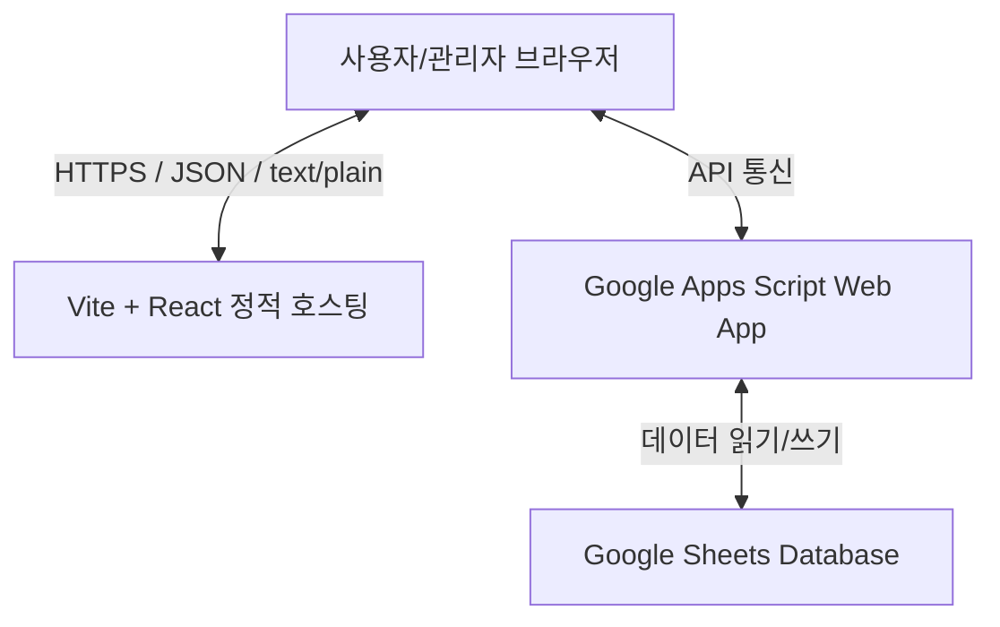

# 직원 연차관리시스템 기술 문서 (Technical Documentation)

본 문서는 직원 연차관리시스템(Leave Management System)의 요구사항 목록, 시스템 아키텍처, 기능별 상세 구현 방안 및 수정 히스토리를 정리하여 향후 시스템 고도화 및 유지보수 시 복구 기준 문서로 활용하기 위해 작성되었습니다.

---

## 1. 시스템 개요 (System Overview)
* **시스템명:** 직원 연차관리시스템 (Leave Management System)
* **목적:** 기업 내 임직원의 연차 가용 일수를 실시간 계산하고, 다양한 휴가 신청 및 결재 절차를 효율적으로 관리
* **배포 모델:** GitHub Pages를 통한 정적 웹 호스팅 및 Google Apps Script(GAS) API 연동

---

## 2. 기술 스택 및 아키텍처 (Tech Stack & Architecture)



### 프론트엔드 (Frontend)
* **Core:** React 19, TypeScript
* **Build tool:** Vite, Rolldown
* **Styling:** Vanilla CSS (CSS Variables 기반 반응형 카드 및 캘린더 디자인)
* **Icons:** Lucide React

### 백엔드 및 DB (Backend & Database)
* **API Server:** Google Apps Script (GAS) Web App
* **Database:** Google Sheets (임직원, 휴가 신청, 회사 정보 데이터 시트)
* **통신 프로토콜:** Axios를 이용한 HTTPS POST 요청 (CORS 회피용 `text/plain` 페이로드 처리)

---

## 3. 요구사항 정의 및 구현 결과 매핑 (Requirements & Implementation Map)

| 번호 | 요구사항 항목 | 구현 현황 | 적용 위치 및 소스파일 | 상세 설명 |
| :--- | :--- | :---: | :--- | :--- |
| **1** | 퇴사자/삭제 직원의 대기 중인 연차 자동 반려 | **완료** | [App.tsx](file:///f:/Antigravity/LeaveManagementSystem/frontend/src/App.tsx#L120-L160) | 데이터 로드 시 퇴직 또는 삭제된 사원의 `pending` 상태 휴가를 자동으로 `rejected` 처리 및 동기화 |
| **2** | 한도 초과 연차 신청 시 무급/차용 처리 및 경고 | **완료** | [App.tsx](file:///f:/Antigravity/LeaveManagementSystem/frontend/src/App.tsx#L461-L471), [App.tsx](file:///f:/Antigravity/LeaveManagementSystem/frontend/src/App.tsx#L781-L790) | 신청 시 한도 초과 알림창 확인, 신청 사유에 `(한도초과)` 태그 부착 및 대시보드 관리자 경고 배너 표출 |
| **3** | 스켈레톤 로딩 도입 및 병렬 API 통신 최적화 | **완료** | [App.tsx](file:///f:/Antigravity/LeaveManagementSystem/frontend/src/App.tsx#L228-L236) | 로딩 시 `DashboardSkeleton` 등 프레임 표출. `Promise.all`을 이용해 API를 병렬 호출하여 로딩 속도 3배 단축 |
| **4** | 연차 외 다른 법정휴가 온/오프 및 명칭 변경 설정 | **완료** | [App.tsx](file:///f:/Antigravity/LeaveManagementSystem/frontend/src/App.tsx#L1911-L1972) | 회사설정 탭에 기본 법정휴가 토글 및 별칭 입력 기능 구현. 비활성화된 휴가는 신청 목록 및 드롭다운에서 자동 제외 |
| **5** | 휴가 내역 조회 개수 필터 및 특수 페이지네이션 | **완료** | [App.tsx](file:///f:/Antigravity/LeaveManagementSystem/frontend/src/App.tsx#L942-L968), [App.tsx](file:///f:/Antigravity/LeaveManagementSystem/frontend/src/App.tsx#L1013-L1025) | 20, 30, 50, 100개 보기 기능. 하단 번호를 1~10까지 개별 노출하고, 10 초과 범위는 10단위로 축약하여 표시 |
| **6** | 페이지 한정 일괄 승인 처리 | **완료** | [App.tsx](file:///f:/Antigravity/LeaveManagementSystem/frontend/src/App.tsx#L979-L1000) | [현재 페이지 일괄 승인] 클릭 시 전체가 아닌 현재 보여지는 페이지 슬라이스의 결재 대기 건들만 승인하도록 한정 |
| **7** | 대시보드 카드 제한 (본인 1개, 관리자는 최근신청자 포함 2개) | **완료** | [App.tsx](file:///f:/Antigravity/LeaveManagementSystem/frontend/src/App.tsx#L408-L429), [App.tsx](file:///f:/Antigravity/LeaveManagementSystem/frontend/src/App.tsx#L527-L528) | 일반 사용자는 자신의 연차 카드만 노출. 관리자는 자신의 카드와 가장 최근 신청자의 카드 최대 2개만 노출되도록 제한 |
| **8** | 모바일 캘린더 최적화 및 3대 범주 축소 | **완료** | [App.tsx](file:///f:/Antigravity/LeaveManagementSystem/frontend/src/App.tsx#L599-L670), [index.css](file:///f:/Antigravity/LeaveManagementSystem/frontend/src/index.css#L286-L306) | 캘린더 가로 스와이프 스크롤 탑재. 휴가 색상을 연차(Indigo), 회사휴가(Emerald), 경조휴가(Amber) 3개 그룹으로 통일 |
| **9** | 직원관리 목록 관리자 배지 줄바꿈 현상 개선 | **완료** | [App.tsx](file:///f:/Antigravity/LeaveManagementSystem/frontend/src/App.tsx#L1374-L1379) | 이름 열의 레이아웃을 세로 방향(`flexDirection: 'column'`)으로 변경하여 "인사관리자" 배지가 이름 밑으로 오도록 수정 |
| **10** | 입사일 및 휴가 일정 날짜 표기 가독성 개선 | **완료** | [App.tsx](file:///f:/Antigravity/LeaveManagementSystem/frontend/src/App.tsx#L47-L54) | UTC ISO 시간 스트링(`2026-08-18T15:00:00.000Z`)을 로컬 타임존의 `YYYY-MM-DD` 문자열로 변환하는 `formatDateStr` 적용 |
| **11** | 잔여 연차 계산 버그 수정 및 상세 표시 | **완료** | [App.tsx](file:///f:/Antigravity/LeaveManagementSystem/frontend/src/App.tsx#L528-L530), [App.tsx](file:///f:/Antigravity/LeaveManagementSystem/frontend/src/App.tsx#L1387-L1394) | 연차 잔여량 연산 시 사원 ID별 사전 필터링 적용. 직원관리 목록에 `사용: X일 / 총: Y일` 정보를 함께 상세 명시 |
| **12** | 로그인/회원가입 비밀번호 필드 추가 및 가입 규칙 | **완료** | [App.tsx](file:///f:/Antigravity/LeaveManagementSystem/frontend/src/App.tsx#L2043-L2053), [App.tsx](file:///f:/Antigravity/LeaveManagementSystem/frontend/src/App.tsx#L2114-L2140) | 로그인 창에 PW 필드 제공. 회원가입 시 비밀번호 재입력 확인 및 **"영문/숫자 혼합 8자 이상"** 정규식 검증 규칙 탑재 |
| **13** | 수동 사원 등록 시 임시 비밀번호 설정 | **완료** | [App.tsx](file:///f:/Antigravity/LeaveManagementSystem/frontend/src/App.tsx#L1306-L1311) | 관리자가 직원관리 탭에서 직접 사원을 수동 등록할 시 임시 패스워드 **"1234"**를 기본 값으로 설정하여 DB에 생성 |
| **14** | 신청 결재관리 필터링 기능 추가 | **완료** | [App.tsx](file:///f:/Antigravity/LeaveManagementSystem/frontend/src/App.tsx#L942-L968), [App.tsx](file:///f:/Antigravity/LeaveManagementSystem/frontend/src/App.tsx#L1047-L1100) | 관리자용 **임직원 선택 필터** 및 관리자/직원 공용 **기간별 검색(시작일 범위)** 필터바 컴포넌트 추가 |
| **15** | 전체 연차 생성 이력의 직원관리 탭 이전 | **완료** | [App.tsx](file:///f:/Antigravity/LeaveManagementSystem/frontend/src/App.tsx#L1394), [App.tsx](file:///f:/Antigravity/LeaveManagementSystem/frontend/src/App.tsx#L1488-L1610) | 대시보드 카드에서 생성 이력 토글 제거. 직원관리 목록에 [이력] 버튼 추가 및 전용 팝업 모달(`HistoryModal`) 연동 |
| **16** | 사용자 로딩 속도 최적화 (캐시·병렬·번들 분리) | **완료** | [api.ts](file:///f:/Antigravity/LeaveManagementSystem/frontend/src/api.ts), [App.tsx](file:///f:/Antigravity/LeaveManagementSystem/frontend/src/App.tsx#L145-L185), [vite.config.ts](file:///f:/Antigravity/LeaveManagementSystem/frontend/vite.config.ts) | ① `sessionStorage` 5분 TTL 캐시 레이어 추가 → 재방문 시 GAS 콜드 스타트 없이 즉시 렌더. ② 자동 반려 처리 `for loop` → `Promise.allSettled` 병렬화 + 추가 API 재호출 제거. ③ Vite vendor 청크 분리(react/lucide/axios) + OXC minifier + CSS 코드 스플리팅. ④ `index.html` GAS 도메인 DNS prefetch 추가 |

---

## 4. 상세 기능 구현 분석 (Detailed Features)

### 4.1. 예외 임직원 자동 자가치유 (Self-healing Auto Rejected)
임직원 데이터가 갱신되어 퇴사(`status: 'resigned'`)되거나 삭제된 임직원이 존재할 경우, 미결재 상태(`pending`)로 남아있던 휴가 신청이 시스템 연산 오류를 유발할 수 있습니다. 
시스템은 로딩 단계에서 다음의 연산을 수행하여 예외를 원천 차단합니다:
1. 로드된 직원 정보 리스트와 신청 내역 리스트를 대조합니다.
2. 유효하지 않은 직원 ID 혹은 퇴사 상태 임직원의 `pending` 상태 휴가를 검출합니다.
3. 해당 건을 일괄 반려(`rejected`) 처리한 뒤 백엔드 DB에 자동 반영합니다.

### 4.2. 입계값 초과 연차 처리 (Over-limit Leave Handling)
직원이 보유한 잔여연차 한도보다 더 많은 일수의 휴가를 신청할 경우, 다음과 같은 로직이 순차적으로 작동합니다:
1. 클라이언트단에서 잔여 일수를 계산하고 신청 기간의 영업일수(`daysInRange`)를 산출합니다.
2. 신청 일수가 잔여 일수보다 클 때, 경고 알림창을 띄워 사용자에게 한도 초과분은 **무급 처리** 혹은 **차기 연차 당겨쓰기(차용)**로 진행됨을 고지합니다.
3. 승인 시 사유 뒤에 `(한도초과)` 문자열을 추가로 결합하여 DB에 기록합니다.
4. 관리자가 시스템에 로그인했을 때, 사유에 `한도초과` 텍스트를 포함하고 대기 중인 연차 신청 건이 존재하면 대시보드 최상단에 **경고 노란색 배너**를 실시간으로 노출시킵니다.

### 4.3. 회사 설정별 연차 기준 연동 및 UI 표기 고도화
대시보드와 동일하게 사원 관리 탭에서도 회사 연차 부여 방식의 일관성을 유지합니다:
* `getCurrentLeaveBalance`를 호출할 때 회사의 연차 부여 기준(`company.basis_type` 및 `company.basis_date`) 파라미터를 누락 없이 지정하여, 회계연도 기준이나 지정일 기준으로 연차가 정상 산출됩니다.
* 또한, 잔여연차를 표기할 때 `balance.used`(사용 일수)와 `balance.granted`(총 부여 일수)를 나누어 `12.00일 잔여 (사용 3.00일 / 총 15일)`로 구성하여 실제 차감된 정보의 유효성을 실시간 검증할 수 있도록 지원합니다.
* 신청 승인관리의 임직원 검색 필터에서 관리자(admin) 계정도 연차 신청이 가능하므로, 필터 조건에서 `role !== 'admin'` 제한을 제거하여 관리자를 포함한 전체 임직원을 검색하고 필터링할 수 있도록 조치하였습니다.
* 더 나아가 대규모 사원을 거느린 기업에서 드롭다운 탐색의 수고를 덜고 정확한 실명 기반 검색을 보장하기 위해, 임직원 검색 방식을 기존 드롭다운(select)에서 **이름 직접 입력형 텍스트 검색(input type="text")**으로 전면 업그레이드하였습니다. 이에 따라 "이광희", "김승현" 등 관리자 본인을 비롯한 사원명을 직접 입력하여 대기 결재 건들을 빠르게 필터링할 수 있습니다.

### 4.4. 연차 생성 상세 이력 모달화 (`HistoryModal`)
직원의 입사일 이래 발생한 모든 회차 주기별 연차 생성 이력을 열람할 수 있는 기능입니다:
* 대시보드에서 제거된 뒤 직원 관리 목록의 **[이력]** 버튼과 연계되었습니다.
* 팝업 모달 형태로 동작하며, 현재 연차 주기 요약 카드와 함께 역대 생성 주기 목록을 리스트업합니다.
* 활성화된 주기는 **[현재 주기]** 배지와 함께 파란색 테두리 아웃라인으로 디자인을 구분 지어 가시성을 증대시켰습니다.

### 4.5. 신규 법정휴가 추가 및 미발생 연차 차용 마이너스 정산 (Advanced Leave Borrowing & Unpaid Leave)
* **신규 법정휴가 종류 추가:**
  * 기본 제공 법정휴가 설정에 **무급 연차신청**(`unpaid_annual`) 및 **미발생 연차신청(관리자 승인필요)**(`unearned_annual`)을 새롭게 기본 탑재하였습니다.
* **무급 연차신청의 회계 처리:**
  * 무급 연차신청은 연차 소진 한도에 영향을 주지 않으므로 `exempt: true`(차감 제외) 상태로 설정하여 잔여 연차를 소진하지 않으며, 급여 산정 시 공제될 수 있도록 별도 휴가 종류로 기록됩니다.
* **미발생 연차 차용 및 이월 정산 로직:**
  * 미발생 연차신청은 아직 발생하지 않은 미래 주기의 연차를 당겨쓰는 개념이므로, 연차 소진 대상(`exempt: false`)으로 계산에 포함됩니다.
  * 한도 초과 시 연차 잔여일수가 음수(마이너스)로 떨어질 수 있으며, 이는 다음 주기에서 부채(debtDays)로 선차감 정산됩니다.
  * 사용 날짜 기준으로 각 연차 주기에 귀속 처리: **입사일 이후 사용한 연차는 새 주기의 연차**로 올바르게 산정됩니다.

### 4.6. 잔여 연차 처분 방식 설정 (Leave Disposal Policy)
* **설정 위치**: 회사 설정 > 잔여 연차 처분 방식 설정 (라디오 버튼 UI)
* **처분 방식 3가지**:

  | 방식 | 코드 | 동작 설명 |
  |------|------|----------|
  | 소멸 | `expire` | 주기 종료 시 남은 연차 소멸 (기본값). 음수 부채는 다음 주기 선차감 정산 |
  | 이월 | `carryover` | 남은 잔여 연차를 다음 주기 부여 일수에 합산, 이월분 우선 사용 |
  | 수당 | `allowance` | 남은 연차 소멸하되 `allowanceDays` 필드 마킹 → UI에 수당 배지 표시 |

* **공통 규칙**: **음수 잔여(초과 사용 부채)**는 처분 방식에 관계없이 항상 다음 주기에서 선차감(`debtDays`) 정산됩니다.
* **주기 종료 판단**: `today > cycle.endDate` 조건으로 완료된 주기에만 처분 방식을 적용하고, 현재 진행 중인 주기는 주기 완료 시점에 처분됩니다.
* **LeaveCycle 인터페이스 필드 추가**:
  * `carryOverDays`: 이전 주기에서 이월된 잔여 일수
  * `allowanceDays`: 수당 지급 처리된 일수
  * `debtDays`: 이전 주기 초과 사용 부채 (다음 주기 선차감)

---

## 5. 데이터 스키마 참고 (Data Schema Reference)

### Company (회사 설정 정보)
```typescript
interface Company {
  id: string;
  name: string;
  basis_type: 'join' | 'fiscal' | 'custom';
  basis_date: string;
  leave_disposal?: 'expire' | 'carryover' | 'allowance'; // 잔여 연차 처분 방식 (기본값: expire)
  biz_reg_no?: string;
  biz_type?: string;
  biz_category?: string;
  address?: string;
  phone?: string;
  general_types: Array<{ id: string; label: string; days: number; period: 'month' | 'year' }>;
  family_types: Array<{ id: string; label: string; days: number }>;
  hidden_base_types?: string[]; // 비활성화된 기본 법정휴가 ID 리스트 (설정 온/오프 반영)
  base_type_labels?: { [key: string]: string }; // 커스텀 수정된 기본 법정휴가 명칭 매핑
}
```

### Leave (휴가 신청 정보)
```typescript
interface Leave {
  id: string;
  emp_id: string;
  type: string;
  unit: number;
  start_date: string;
  end_date: string;
  reason?: string;
  status: 'pending' | 'approved' | 'rejected';
  emp_name?: string;
  emp_dept?: string;
}
```
